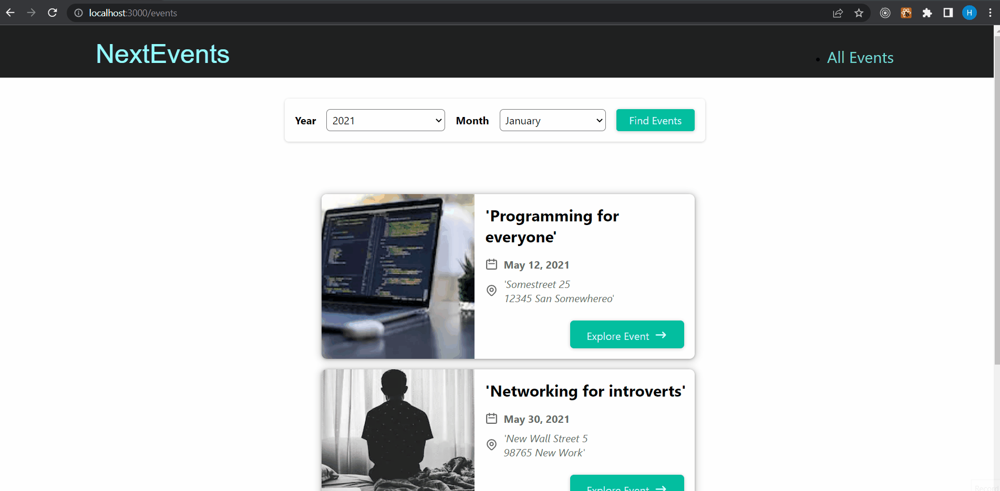

<!-- Please update value in the {}  -->

<h1 align="center">NextJS Newsletter App</h1>

<div align="center">
  <h3>
    <a href="https://github.com/hsynarsln/Next.js-Newsletter-App.git">
      Project
    </a>
  </h3>
</div>

<!-- TABLE OF CONTENTS -->

## Table of Contents

- [Overview](#overview)
- [Built With](#built-with)
- [How to use](#how-to-use)
- [Acknowledgements](#acknowledgements)
- [Contact](#contact)

<!-- OVERVIEW -->

## Overview



### Built With

<!-- This section should list any major frameworks that you built your project using. Here are a few examples.-->

- NextJS
- MongoDB

## How To Use

<!-- This is an example, please update according to your application -->

To clone and run this application, you'll need [Git](https://git-scm.com)

```bash
# Clone this repository
$ git clone https://github.com/hsynarsln/Next.js-Newsletter-App.git

# Install dependencies
    > npm run dev
    # or
    > yarn dev

# Run the app
$ npm start
```

## Acknowledgements

- Information for your projects

## Contact

- Email (hsyn06arslan@gmail.com)

- GitHub (https://github.com/hsynarsln)

- Linkedin (https://www.linkedin.com/in/huseyinarsln/)
